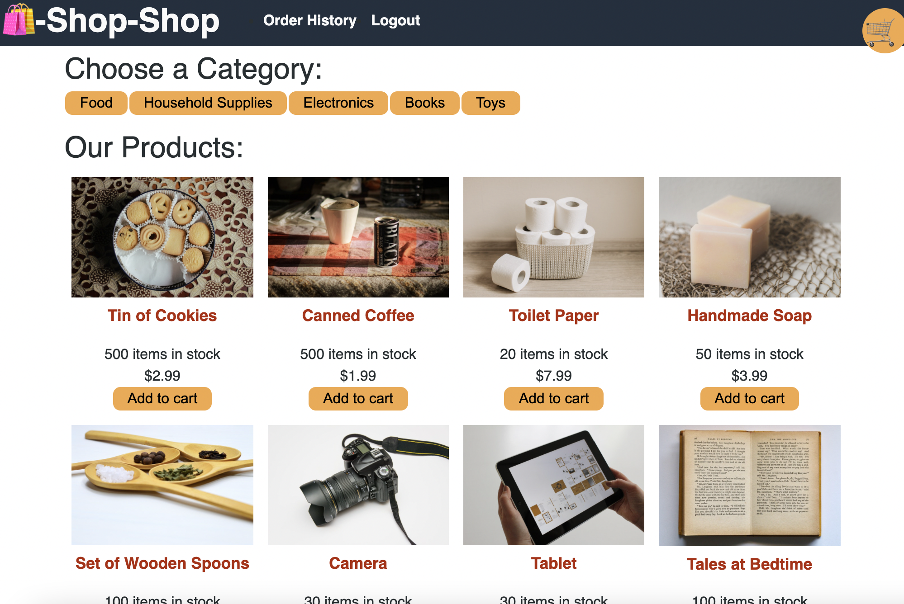
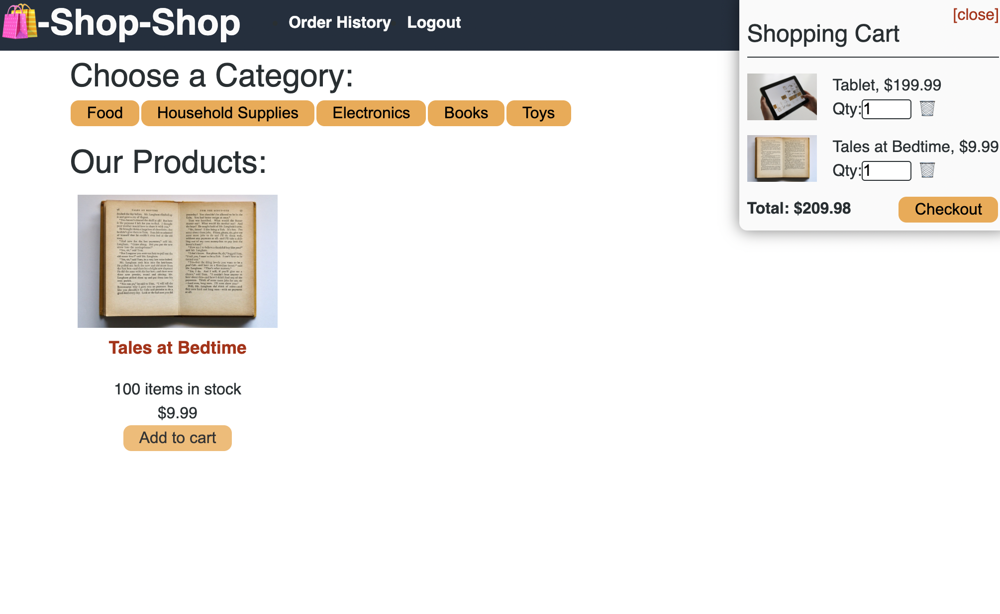
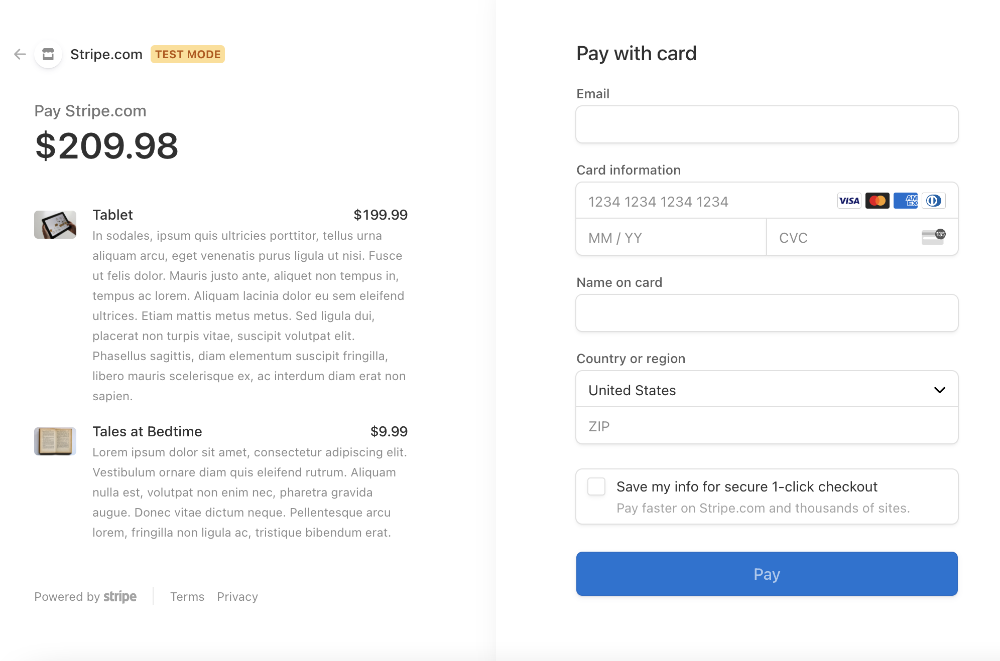

  # Redux Online Shopping

  

  ## Description
  Shop until you drop with the Redux Online Shopping e-commerce website. Viewing products, adding to your cart, and even checking out, this application allows users to create an account and shop for the website's products. This application was created with Node.js, GraphQL, Apollo Server, MongoDB, React and Redux.

  ## Table of Contents
  * [Installation](#installation)
  * [Usage](#usage)
  * [License](#license)
  * [Contact](#contact)

  ## Installation
  Clone repository. Run "npm install" in the terminal. Run "npm start" from root directory.

  ## Usage
  Create an account or log in if one has already been created. Explore shopping items. Click to add to cart once one is looking to be purchased. Checkout will then take you to a separate website powered by Stripe to proceed to purchase the item.

  View live link here.

  
   
    

  ## License
  License for this project: [MIT License](https://choosealicense.com/licenses/mit/)

  ## Contact
  With any questions or concerns, please contact me via GitHub at [cianfich1016](https://github.com/cianfich1016) or by email at cianfich@gmail.com.